CUDA Path Tracer
================

**University of Pennsylvania, CIS 5650: GPU Programming and Architecture, Project 3**

* Xuan Zhu
* Tested on: Windows 11 (build 26200), NVIDIA GeForce RTX 5070 12 GB, CUDA 13.3, Visual Studio 2022 (MSVC 19.44), Release build

*Sci-fi corridor: 9 OBJ meshes (~152k triangles), GGX metal panels, emissive light strips, HDR bloom and ACES tone mapping. 1920x1080, 5000 samples per pixel, ~108 ms per iteration including bloom.*

A physically based, GPU-only path tracer written in CUDA. Every bounce of every path runs as a stream of kernels (generate → intersect → shade → compact), with a BVH for meshes, importance-sampled HDR environment lighting, next event estimation with multiple importance sampling, GGX microfacet materials, textures and normal maps.

## Contents

- [Feature overview](#feature-overview)
- [Gallery](#gallery)
- [Core path tracer](#core-path-tracer)
- [Materials](#materials): refraction, GGX metal / glossy, rough glass
- [Lighting and sampling](#lighting-and-sampling): HDR environment, environment importance sampling, NEE + MIS
- [Camera](#camera): thin-lens depth of field
- [Meshes and acceleration](#meshes-and-acceleration): OBJ loading, bounding-box culling, SAH BVH
- [Textures](#textures): image textures, procedural texture, normal mapping
- [Post-processing](#post-processing): ACES tone mapping, HDR bloom
- [Performance analysis](#performance-analysis)
- [Debugging story: the 1.8 FPS glass bunny](#debugging-story-the-18-fps-glass-bunny)
- [Bloopers](#bloopers)
- [Scene file format](#scene-file-format)
- [Build notes and third-party code](#build-notes-and-third-party-code)
- [References](#references)

## Feature overview

| Area | Feature | Toggle / scene key |
|---|---|---|
| Core | Diffuse and perfect-specular BSDFs, stochastic antialiasing | always on |
| Core | Stream compaction of terminated paths (`thrust::partition`) | `STREAM_COMPACTION` |
| Core | Sorting paths by material before shading | `SORT_BY_MATERIAL` |
| Materials | Refraction with Fresnel (Schlick), rough glass via GGX microfacet normals | `"Refractive"`, `ROUGHNESS` |
| Materials | GGX microfacet metal and glossy (dielectric coat over diffuse), VNDF sampling | `"Metal"`, `"Glossy"` |
| Lighting | HDR environment map (equirectangular, rotation, intensity) | `"Environment"` block |
| Lighting | Environment importance sampling (luminance × sin θ CDF) | `ENV_NEE` |
| Lighting | Next event estimation for environment and area lights, MIS with the power heuristic | `ENV_NEE`, `LIGHT_NEE` |
| Camera | Thin-lens depth of field | `LENS_RADIUS`, `FOCAL_DISTANCE` |
| Meshes | OBJ loading (normals, UVs) with toggleable bounding-box culling | `MESH_BBOX_CULLING` |
| Acceleration | BVH, binned SAH build on the CPU, iterative near-first traversal on the GPU | `USE_BVH`, `BVH_USE_SAH` |
| Acceleration | Russian roulette path termination | `RUSSIAN_ROULETTE` |
| Textures | Image textures (bilinear, sRGB → linear), procedural 3D checker, tangent-space normal maps | `TEXTURE`, `PROCEDURAL`, `NORMAL_MAP` |
| Post | ACES filmic tone mapping, HDR bloom | `TONEMAP`, `BLOOM` |
| Tooling | Per-kernel CUDA-event profiler, per-bounce alive-path counts, NaN ray counter | `PROFILE` |

## Gallery

| | |
|---|---|
| 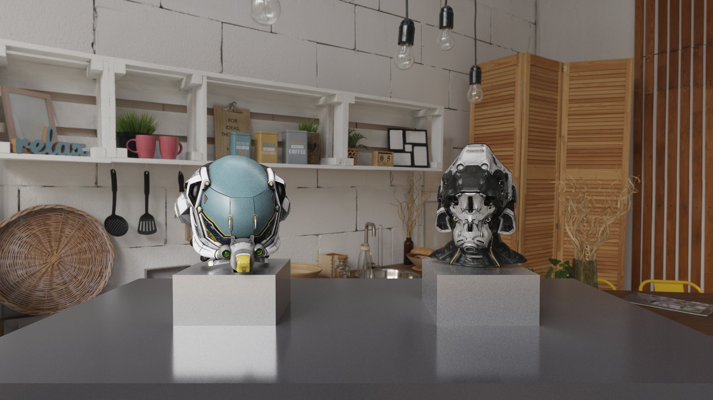 | 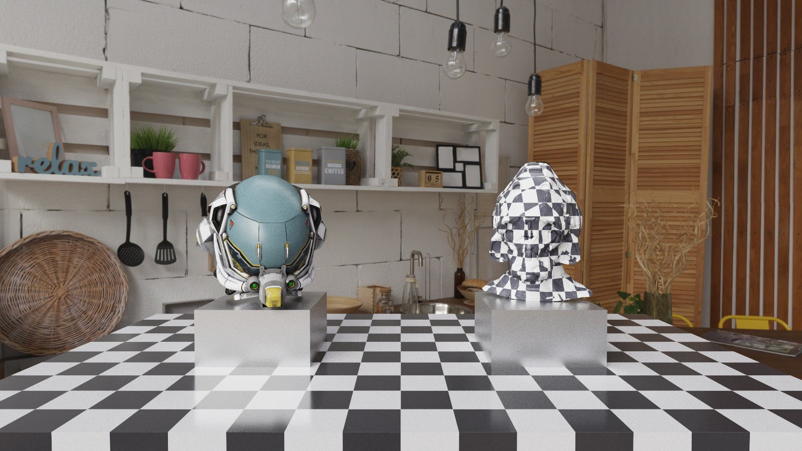 |
| *Image textures + normal maps (Khronos sample helmets, 39k triangles), studio HDRI* | *Procedural checker floor and helmet next to an image-textured helmet* |
| 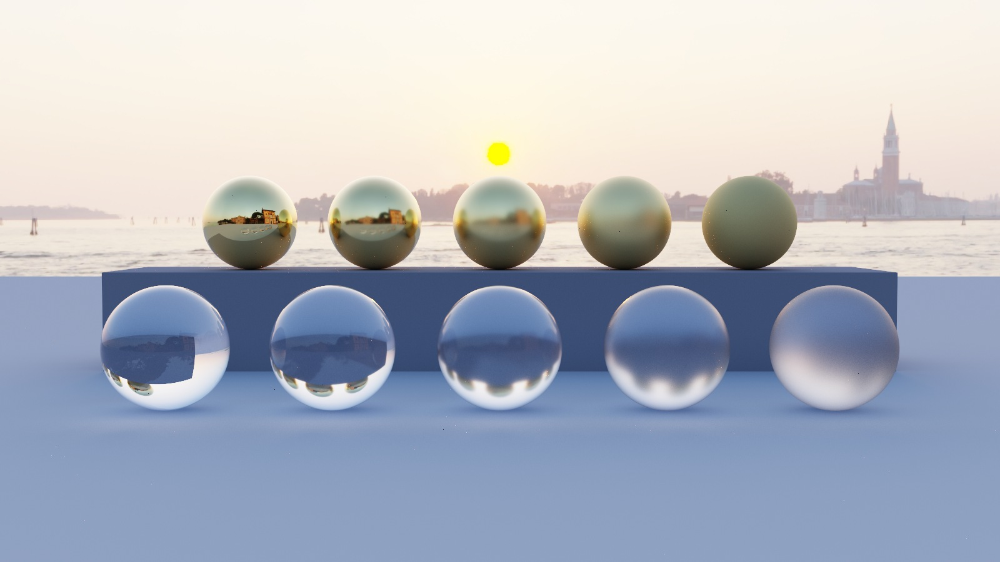 |  |
| *Top: GGX gold, roughness 0.05 → 0.8. Bottom: rough glass, roughness 0 → 0.5* | *Glass Stanford bunny (69k triangles) at sunset, importance-sampled 8K HDRI* |

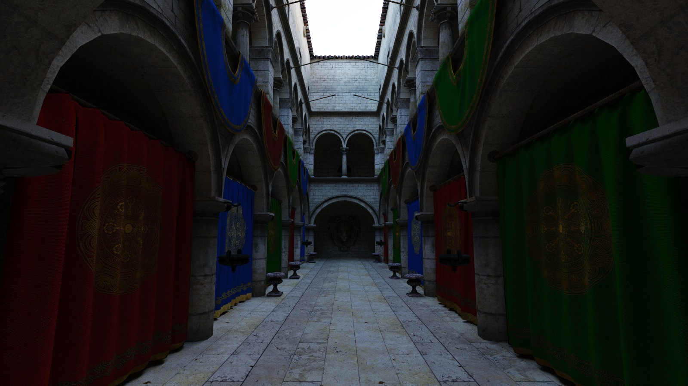
*Crytek Sponza (227k triangles, 22 image textures), lit only by the 8K sunset HDRI through the open roof. 1600x900, 2000 spp, ~99 ms per iteration.*

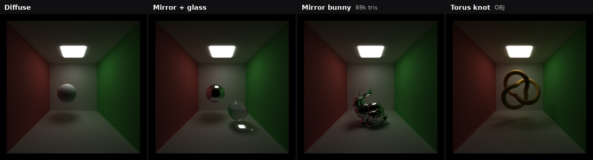
*Cornell box test scenes: diffuse, mirror and glass spheres, mirror bunny, OBJ torus knot.*

---

## Core path tracer

Each iteration shoots one jittered camera ray per pixel and then loops over bounces. One bounce is three kernels:

1. **`computeIntersections`**: one thread per alive path finds the closest hit (spheres, cubes, meshes through the BVH).
2. **`shadeMaterial`**: one thread per path evaluates the material, adds next-event-estimation contributions, samples the next direction, and applies Russian roulette.
3. **Stream compaction**: `thrust::partition` moves the paths that are still alive to the front of the array, so the next bounce only launches threads for them.

**BSDFs.** Diffuse surfaces use cosine-weighted hemisphere sampling (throughput multiplies by the albedo, the cosine and the pdf cancel). Perfect mirrors reflect about the normal.

**Stochastic antialiasing.** The camera ray goes through a uniformly random point inside the pixel instead of its center, so averaging over iterations box-filters the pixel. It is free on the GPU: two extra random numbers per ray.

**Material sorting** and **stream compaction** are analyzed with numbers in [Performance analysis](#performance-analysis).

## Materials

### Refraction (Schlick Fresnel)

Glass picks reflection or refraction stochastically with probability equal to the Fresnel reflectance (Schlick's approximation), so no extra rays are spawned and the estimator stays unbiased. Total internal reflection is detected explicitly before calling `glm::refract` (see the [debugging story](#debugging-story-the-18-fps-glass-bunny) for why).

### GGX microfacet metal and glossy

`Metal` and `Glossy` materials use a GGX (Trowbridge-Reitz) microfacet BRDF with **visible-normal (VNDF) sampling** (Heitz 2018). With VNDF sampling the sample weight `f·cos/pdf` collapses to `F · G1(wi)`, so the throughput never explodes at grazing angles, which plain NDF sampling suffers from.

* **Metal**: F0 = base color, so the reflection is tinted (the gold spheres).
* **Glossy**: a dielectric coat (F0 = 0.04) over a diffuse base. Each bounce picks the specular lobe with probability 0.35 or the diffuse lobe otherwise; the diffuse lobe is attenuated by `1 - F` of the coat.
* **Rough glass**: the refraction and reflection happen about a GGX microfacet normal sampled with VNDF instead of the geometric normal. Samples that end up on the wrong side of the surface are discarded.

The top row of the GGX image shows roughness 0.05, 0.15, 0.3, 0.5, 0.8 for gold; the bottom row shows glass with roughness 0, 0.08, 0.18, 0.32, 0.5.

**Performance.** Each microfacet bounce costs one VNDF sample (a few `sqrt`/`sin`/`cos`) plus a Smith G1 term. On the GPU the cost is not the math but **divergence**: a warp that mixes diffuse, glossy and glass paths runs every branch. Material sorting was meant to fix this, but in my scenes it costs much more than it saves ([below](#material-sorting)).

**GPU vs CPU.** A CPU tracer would do the same per-sample math, but it has no warps, so mixing materials costs nothing extra there. On the GPU the shading kernel is short in most test scenes (about 1–5 ms per iteration; Sponza with 22 textures is the exception at 27 ms), so divergence is a minor cost compared with intersection and compaction.

**Future work.** NEE currently runs only on diffuse surfaces (glossy lobes skip MIS), so small light sources reflected in rough metal converge slower than they could. Adding light sampling + MIS for the GGX lobes would fix that.

## Lighting and sampling

### HDR environment map

Rays that leave the scene look up an equirectangular `.hdr` image (nearest-texel lookup, rotation in degrees, intensity scale). With 8K maps one texel is about 0.04°, so filtering is not visible at these resolutions. The 8K Venice sunset and the 8K brown photo studio from Poly Haven light most of the scenes.

### Environment importance sampling + NEE + MIS

A bright sun covers a tiny fraction of the sphere, so BSDF sampling almost never finds it and the image is full of noise and fireflies. I build a **1D CDF over every pixel of the HDR**, weighted by luminance × sin θ (the sin θ accounts for the equirectangular map squeezing pixels near the poles). At each diffuse hit:

1. Sample an environment direction by binary search in the CDF. Its solid-angle pdf is `p_pixel · W · H / (2π² sin θ)`.
2. Trace a shadow ray. If it is unoccluded, add the light weighted by the **power heuristic** against the BSDF pdf.
3. Continue the path with BSDF sampling. If that BSDF ray escapes to the environment, it is weighted by the power heuristic against the environment pdf, so no light is counted twice.

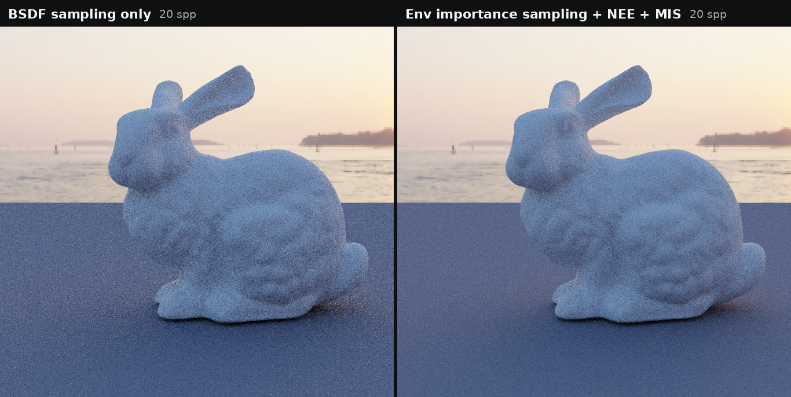
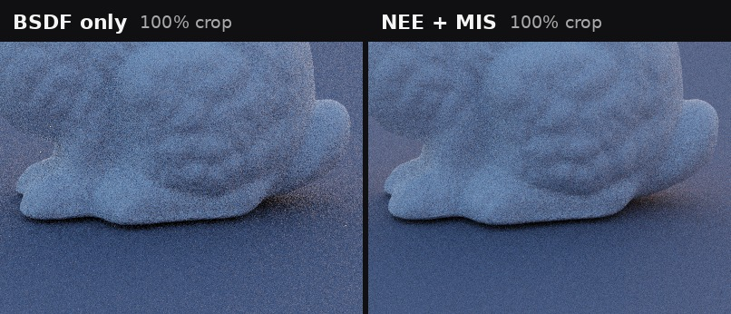

| 20 spp | BSDF sampling only | Env NEE + MIS |
|---|---|---|
| Glass bunny scene: RMSE vs 5000 spp reference | 0.0477 | **0.0387** (−19%) |
| Diffuse bunny: high-frequency noise | 0.0310 | **0.0228** (−26%) |
| Shade kernel time (diffuse bunny) | 0.8 ms | 3.2 ms |
| Mean image brightness | 0.6322 | 0.6335 (same: no bias) |

**Performance.** The extra cost is one CDF binary search (25 steps for an 8K map) and one shadow ray per diffuse hit: +2.4 ms per iteration in the diffuse-bunny scene, +1.7 ms in the glass-bunny scene. For the same noise level BSDF-only sampling needs roughly 1.5–1.9× more samples, so it pays off.

**GPU vs CPU.** The CDF is built once on the CPU (33.6M pixels, double-precision prefix sum) and uploaded. A binary search is a good fit for the GPU: it is short, branch-light, and every thread does the same number of steps.

**Future work.** A 2D (marginal + conditional) CDF would cut the search to two short searches and improve cache locality. A guide-map or MIS compensation (Karlík 2019) would reduce the remaining variance from the sky.

### Area-light NEE + MIS

Emissive cubes and spheres are collected into a light list when the scene loads. At each diffuse hit one light is picked uniformly, a point is sampled uniformly by area (cube faces chosen in proportion to their area), and the area pdf is converted to solid angle: `pdf = d² / (cos θ_light · A · N_lights)`. BSDF-sampled rays that hit a light are MIS-weighted the same way.

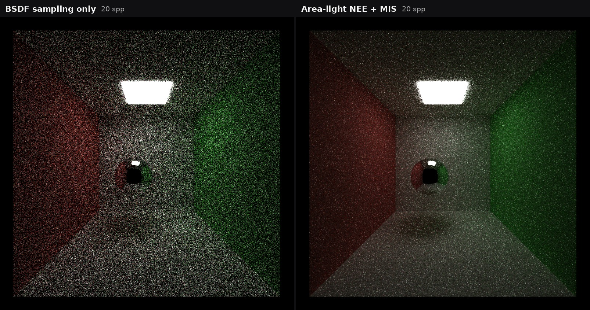

At 20 spp the mean brightness matches BSDF sampling (0.1381 vs 0.1365, unbiased) while the per-channel relative noise drops from 0.93/1.03/1.10 to 0.41/0.38/0.45, **about 2.5× less noise**, which is roughly 6× fewer samples for the same quality.

## Camera

### Thin-lens depth of field

The camera ray starts at a uniformly sampled point on a lens disk of radius `LENS_RADIUS` and passes through the point where the pinhole ray meets the focal plane at `FOCAL_DISTANCE`. Like antialiasing, the blur comes for free from averaging iterations.

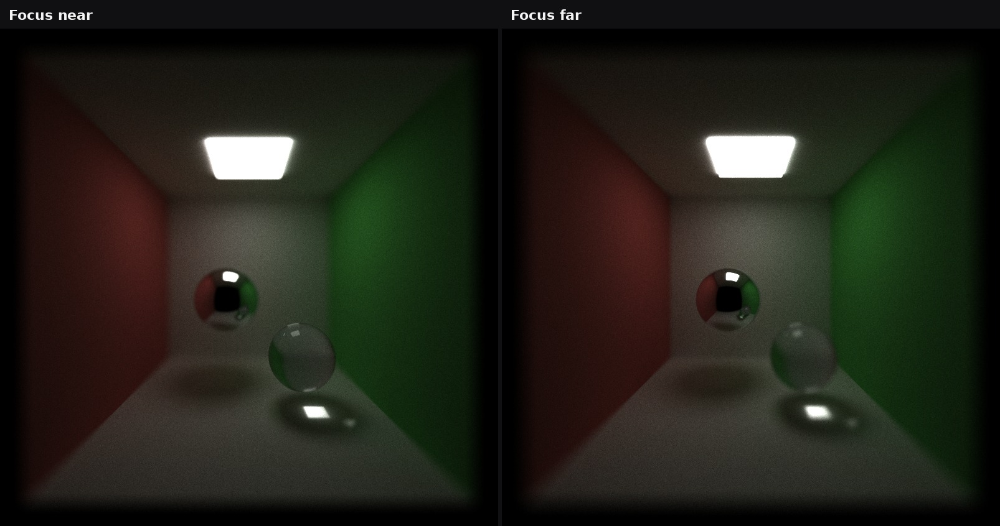
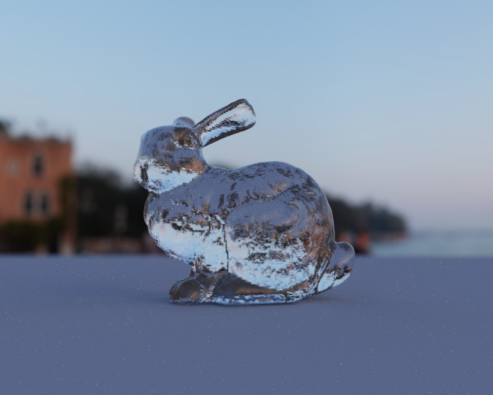

**Performance.** Two extra random numbers and a few multiplies per camera ray; not measurable next to the bounce loop. A CPU version would be equally cheap; the feature is about correctness, not speed.

## Meshes and acceleration

### OBJ loading and bounding-box culling

OBJ files are loaded with tinyobjloader. Triangles are stored in world space with per-vertex normals and UVs; missing or NaN vertex normals are replaced by the face normal. Each mesh keeps its world-space bounding box, and a ray that misses the box skips the whole mesh. Without a BVH, culling cut the torus-knot intersection time from **193.6 ms to 137.7 ms**.

### BVH (binned SAH)

Each mesh gets its own BVH, built on the CPU and flattened into one array of 32-byte nodes (two nodes per 64-byte cache line). Children are stored next to each other, so a node only needs one index.

* **Build:** binned SAH with 16 bins per axis. Nodes with ≤ 4 triangles always become leaves, and nodes with ≤ 16 triangles also become leaves when the SAH cost of the best split is no better than testing every triangle.
* **Traversal:** iterative with a 64-entry per-thread stack. Both children are tested; the nearer child is visited first and the farther one is pushed with its entry distance, and a popped node is skipped if a closer hit was already found ("closest-hit pruning"). NEE shadow rays use the same traversal.

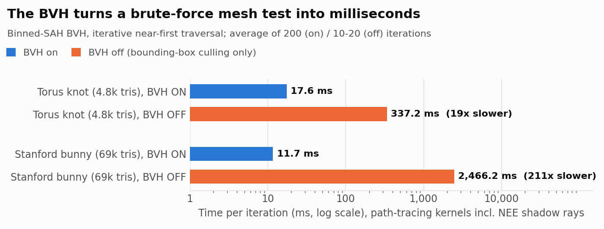

| Scene (total per iteration) | BVH off | BVH on | Speedup |
|---|---|---|---|
| Torus knot (4.8k triangles) | 337.2 ms | 17.6 ms | 19× |
| Stanford bunny (69k triangles) | 2466.2 ms | 11.7 ms | 211× |

The speedup grows with triangle count because the brute-force cost is linear in triangles while BVH traversal is roughly logarithmic.

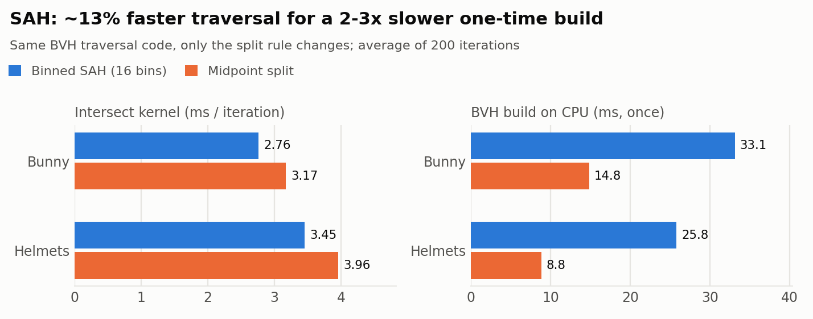

| Scene | Split | Nodes | Build (CPU, once) | Intersect per iteration |
|---|---|---|---|---|
| Bunny | SAH | 43,501 | 33.1 ms | **2.76 ms** |
| Bunny | Midpoint | 44,817 | 14.8 ms | 3.17 ms |
| Helmets | SAH | 25,850 | 25.8 ms | **3.45 ms** |
| Helmets | Midpoint | 26,886 | 8.8 ms | 3.96 ms |

SAH traversal is about **13% faster** on both scenes. The build is 2–3× slower, but it runs once and is paid back after 35–45 iterations of a 5000-iteration render.

**GPU vs CPU.** Building on the CPU is simple and fast enough (tens of milliseconds). The traversal is where the GPU has to be careful: recursion is replaced by an explicit stack, and incoherent secondary rays make warps take different paths through the tree, which is why intersect time grows after the first bounce even though fewer paths are alive.

**Future work.** A two-level BVH (TLAS over the per-mesh BLAS) would stop the intersection kernel from looping over every mesh; wide BVHs (BVH4/8) and compressed nodes would cut memory traffic; sorting rays by direction before traversal would make secondary rays more coherent.

## Textures

### Image textures

All textures are packed into one `glm::vec3` array on the GPU with an `(offset, width, height)` table, so any number of textures costs one device pointer. Lookups are bilinear with repeat wrapping, and 8-bit color images are converted to linear (gamma 2.2) once at load time.

### Procedural texture

A 3D checker computed from the world-space hit point: `parity(floor(p · scale))` picks between two colors. Because it uses the position, it works on cubes and spheres that have no UVs.

| Helmets scene, both helmets | Shade kernel |
|---|---|
| Image texture (4 texel fetches, bilinear) | 1.134 ms |
| Procedural checker (a few ALU ops) | 1.10 ms |

The procedural texture is about **3% faster**: it trades 4 global-memory reads for a handful of instructions, but texture lookups are a small part of shading, so the gap is small. The procedural version also has no memory footprint, while the image version scales to any detail.

### Normal mapping

For every triangle I compute a tangent frame from its edge vectors and UV deltas at load time. In the shading kernel the tangent is Gram-Schmidt-orthogonalized against the interpolated normal, the bitangent is flipped if the UVs are mirrored, and the normal-map sample (stored linear, not sRGB) is transformed from tangent space to world space. The new normal is then used for NEE and for sampling the next bounce.

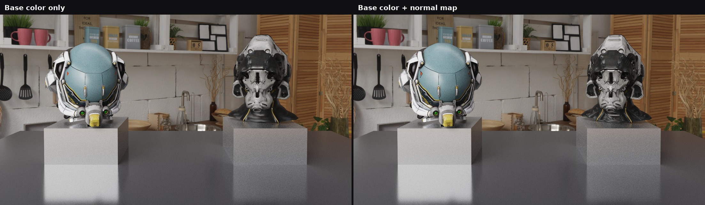
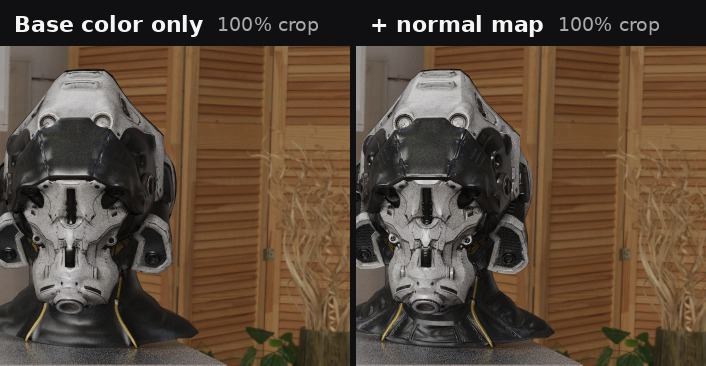

**Performance.** With the same build and scene, turning the normal maps on raises shade time from 1.53 ms to 1.62 ms (+6%): one more bilinear fetch and a TBN transform per textured hit. Supporting normal maps at all also added two `vec3`s (tangent, bitangent) to every intersection record, which raised shade time in the helmets scene from 1.13 ms to about 1.33 ms even before any normal map is sampled, because every thread reads and writes a larger struct.

**GPU vs CPU / future work.** CUDA texture objects would give hardware bilinear filtering and a texture cache for free and should make both fetches cheaper; mipmapping would remove aliasing on distant surfaces; and storing tangents per vertex (MikkTSpace) instead of per triangle would remove the faceting visible on low-poly UV seams.

## Post-processing

### ACES filmic tone mapping

The accumulated image stays in linear HDR. For display and saving it goes through the ACES filmic curve (Narkowicz 2015) and gamma 2.2, which keeps bright light sources and sun reflections from clipping to flat white.

### HDR bloom

1. **Bright pass** on the linear HDR average: keep only the energy above a threshold (`BLOOM_THRESHOLD`).
2. **Separable Gaussian blur**: one horizontal and one vertical pass (σ = radius / 3), O(r) instead of O(r²) work per pixel.
3. The blurred glow is added at display time only, so it never feeds back into the accumulation.

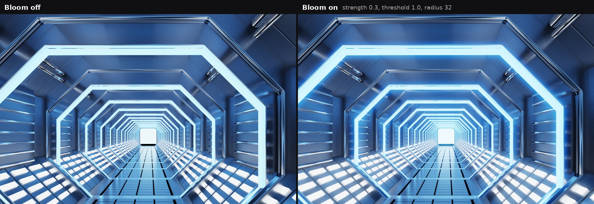

**Performance.** About **3.6 ms per frame** at 1080p with radius 32 (104.5 → 108.1 ms in the corridor). On the GPU each pixel is independent, so both blur passes are embarrassingly parallel; a CPU version would spend seconds on a 65-tap blur over 2 million pixels.

**Future work.** Run the bloom only when the display is refreshed instead of every iteration, use shared memory tiles for the blur, and use a downsampled mip chain to get wide glows cheaply.

---

## Performance analysis

All timings: RTX 5070, Release build, CUDA events around each kernel, averaged over 200 iterations (10–20 iterations for the very slow BVH-off runs and the 20 spp NEE runs). Raw logs are in [`perf/raw_logs.txt`](perf/raw_logs.txt) and tables in [`perf/summary.md`](perf/summary.md).

### Stream compaction: open vs closed scenes

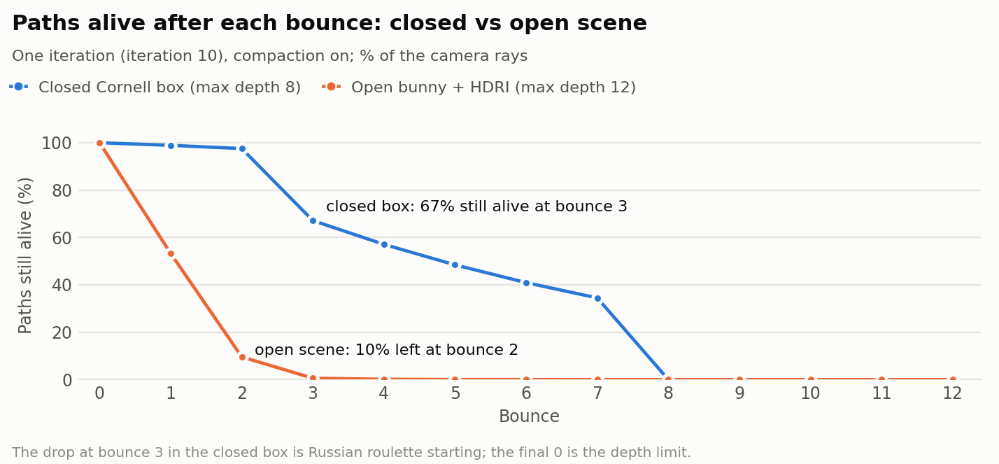

In the **open** scene (diffuse bunny under an HDRI), 47% of paths escape after the first bounce and 90% after the second, so compaction shrinks every later kernel launch. In the **closed** Cornell box no path can escape: 97% are still alive after two bounces, and they only start dying once Russian roulette kicks in at bounce 3.

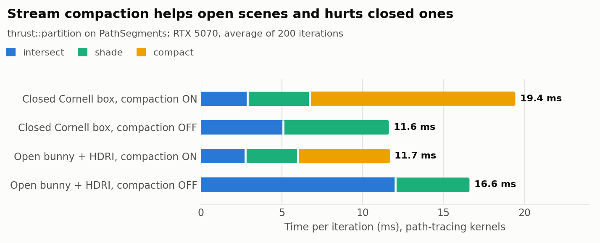

| Scene | Compaction | Intersect | Shade | Compact | Total |
|---|---|---|---|---|---|
| Closed Cornell box | on | 2.88 | 3.84 | 12.71 | 19.43 |
| Closed Cornell box | off | 5.10 | 6.52 | 0 | **11.62** |
| Open bunny + HDRI | on | 2.76 | 3.23 | 5.69 | **11.68** |
| Open bunny + HDRI | off | 12.03 | 4.57 | 0 | 16.60 |

* **Open scene: compaction is a clear win (−30%).** Without it, terminated paths keep occupying threads and their stale rays are still intersected every bounce, so intersect time grows 4.4×.
* **Closed scene: compaction is a net loss.** It does cut intersect and shade time by about 40%, but `thrust::partition` costs 12.7 ms per iteration: it moves whole `PathSegment` structs (ray, throughput, pixel index, bounce count, pdf) every bounce, while very few paths are removed.

**Future optimization:** compact a 4-byte index array (or the path indices with a custom scan) instead of the full structs, and skip compaction when few paths died this bounce.

### Material sorting

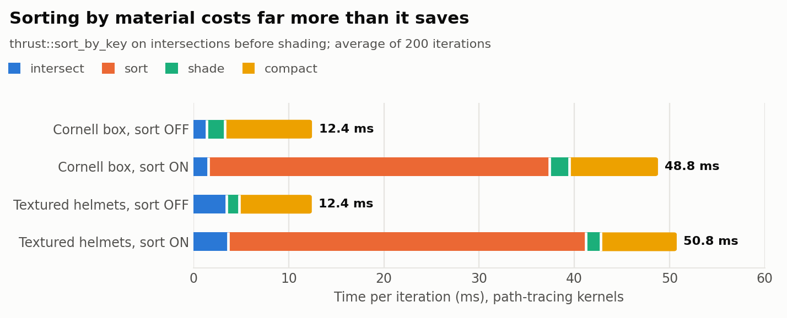

| Scene | Sort | Sort time | Shade | Total |
|---|---|---|---|---|
| Cornell box | off | 0 | 1.92 | **12.45** |
| Cornell box | on | 35.88 | 2.06 | 48.78 |
| Textured helmets | off | 0 | 1.33 | **12.42** |
| Textured helmets | on | 37.61 | 1.54 | 50.75 |

Sorting makes the frame **4× slower** and does not even make shading faster. My scenes have few materials and shading is short (about 1–2 ms here), so there is little divergence to remove, while `thrust::sort_by_key` with a struct comparator falls back to a comparison sort that moves both the intersections and the path segments. Sorting would only pay off with many materials and expensive BSDFs; the cheaper way to get there is a radix sort on 32-bit material keys that only permutes an index array. The toggle stays off by default.

### Russian roulette

From bounce 3 on, a path survives with probability `p = min(1, max(throughput.r, g, b))` and its throughput is divided by `p`, so the estimate stays unbiased.

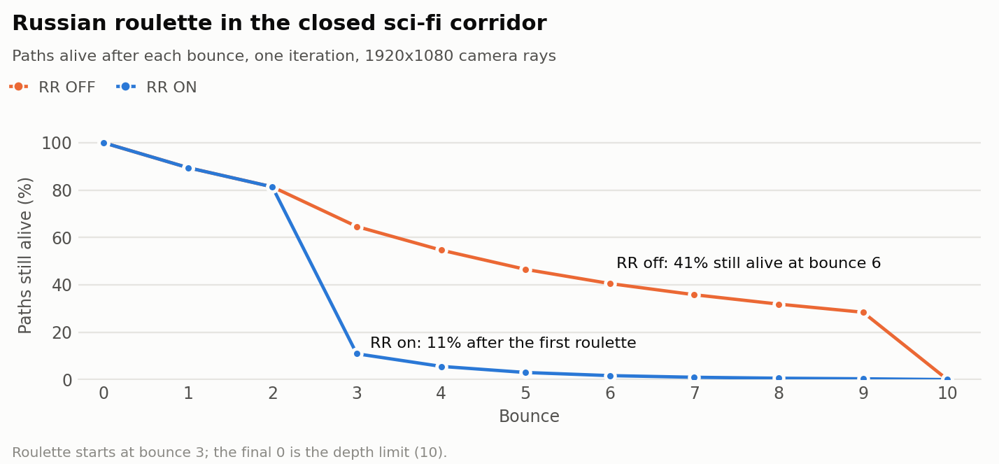
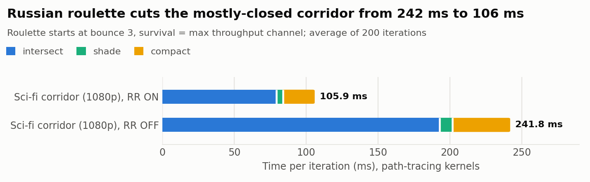

| Scene | RR off | RR on | Speedup |
|---|---|---|---|
| Sci-fi corridor (closed, 1080p, depth 10) | 241.8 ms | **105.9 ms** | 2.3× |
| Cornell box (closed, depth 8) | 13.7 ms | **12.4 ms** | 1.1× |

In the corridor the dark metal walls absorb most of the energy but no ray can escape, so without roulette 28% of paths are still alive at bounce 9. Roulette removes the paths that would contribute almost nothing. The effect is largest exactly where stream compaction alone fails: in closed scenes.

### Smaller optimizations

| Change | Before | After |
|---|---|---|
| Pass `Geom` by reference in the intersection loop (avoid copying three 4×4 matrices per object per ray) | 6.36 ms | 4.27 ms intersect |
| Mesh bounding-box culling (BVH off, torus knot) | 193.6 ms | 137.7 ms intersect |
| Detect TIR before `glm::refract` (see below) | 702 ms | 4.0 ms intersect |

### Where the time goes

Across the test scenes in their default configuration **stream compaction is usually the largest single kernel** (5.7–22 ms), followed by intersection. That makes "compact indices instead of structs" the most promising next optimization. A full wavefront architecture (one kernel per material type, with queues instead of a sort) is the natural next step after that.

---

## Debugging story: the 1.8 FPS glass bunny

The glass bunny at sunset ran at **1.8 FPS**, while the same bunny made of chrome or diffuse material needed only about 2.5 ms per iteration to intersect. My first guess was broken mesh normals; the loader reported zero. Swapping materials showed it was only glass, and per-bounce timing showed something odd: one bounce with only **6 alive paths took 48 ms**.

I added a device counter for rays whose origin or direction was not finite: **18% of the glass rays were NaN**. A NaN ray fails every bounding-box test in a way that never prunes, so it walks the entire BVH, and a single such thread stalls its whole warp.

The cause was GLM 0.9.6's vector `refract`: on total internal reflection it computes `(… sqrt(k) …) * (k >= 0)`, and with `k < 0` that is `NaN * 0 = NaN`, not zero. The fix is to test `k < 0` myself and reflect in that case.

| | Before | After |
|---|---|---|
| NaN rays per bounce | 18% | 0 |
| Intersect time | 702 ms | **4.0 ms** |
| Frame rate | 1.8 FPS | **41.8 FPS** |

The fix also removed dark speckles from the glass. As a safety net, `computeIntersections` now drops non-finite rays, and the final gather ignores non-finite samples.

## Bloopers

| | |
|---|---|
|  | 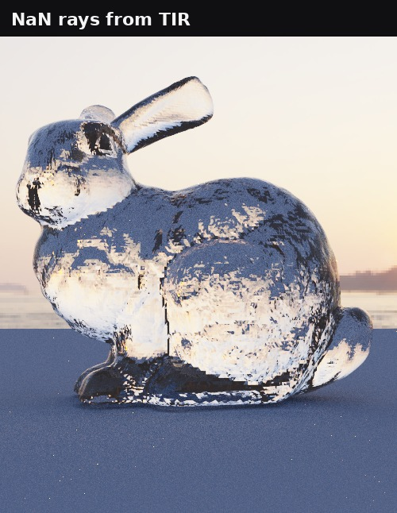 |
| *The GGX test scene, seen from under the floor. The base code's orbit camera derived its pitch and yaw with mirrored angles, so the camera started below the stage instead of at the `EYE` in the scene file. Fixed by deriving θ and φ from the actual eye-to-target offset.* | *Glass bunny before the TIR fix: NaN rays leave dark streaks inside the glass, and made the intersection kernel 175× slower.* |

## Scene file format

The JSON format from the base code is extended; all new keys are optional.

**Materials**

| Key | Applies to | Meaning |
|---|---|---|
| `"TYPE": "Metal"` / `"Glossy"` | new types | GGX metal (F0 = `RGB`) / dielectric coat over diffuse |
| `ROUGHNESS` | Metal, Glossy, Refractive | GGX roughness (0 = perfect mirror or smooth glass) |
| `TEXTURE` | Diffuse, Metal, Glossy | base-color image, multiplied with `RGB` |
| `NORMAL_MAP` | any (meshes with UVs) | tangent-space normal map |
| `PROCEDURAL`, `PROC_SCALE`, `RGB2` | any | `"Checker"` texture, cells per unit, second color |

**Environment** (top-level block): `FILE` (equirectangular `.hdr`), `INTENSITY`, `ROTATION` (degrees).

**Camera**: `LENS_RADIUS`, `FOCAL_DISTANCE` (depth of field), `TONEMAP` (ACES on/off), `BLOOM` (strength, 0 = off), `BLOOM_THRESHOLD`, `BLOOM_RADIUS` (pixels, default 24).

**Objects**: `"TYPE": "mesh"` with `FILE` (path to an `.obj`, relative to the scene file).

Example scenes: `scifi_corridor.json` (cover), `helmets_textured.json`, `helmets_procedural.json`, `sponza_textured.json`, `ggx_spheres.json`, `bunny_sunset.json`, `cornell_*.json`.

## Build notes and third-party code

* **CMakeLists.txt:** added `-Xcompiler=/Zc:preprocessor` for CUDA sources, which MSVC needs to compile the CCCL/Thrust headers in CUDA 13.
* **main.cpp:** exports `NvOptimusEnablement` / `AmdPowerXpressRequestHighPerformance` so laptops with hybrid graphics run the OpenGL window on the discrete GPU.
* **Base-code fix:** the orbit camera's initial θ/φ were computed with mirrored angles; they are now derived from the eye-to-target offset.
* `stream_compaction/` contains my Project 2 implementation as required; the path tracer itself uses `thrust::partition`.

**Third-party code and assets**

* [tinyobjloader](https://github.com/tinyobjloader/tinyobjloader) (MIT): OBJ parsing.
* [stb_image](https://github.com/nothings/stb) (public domain, from the base code): PNG/JPG/HDR loading.
* HDRIs from [Poly Haven](https://polyhaven.com/) (CC0): Venice Sunset, Brown Photostudio 02, Studio Small 09.
* Helmets from the [Khronos glTF Sample Assets](https://github.com/KhronosGroup/glTF-Sample-Assets), converted to OBJ: *Damaged Helmet* by theblueturtle_ (CC BY-NC 4.0, glTF conversion by ctxwing, CC BY 4.0) and *Sci-Fi Helmet* by Michael Pavlovich (CC0).
* Crytek Sponza (© 2016 Crytek, CRYENGINE Limited License), from the Khronos glTF Sample Assets, converted to OBJ.
* [Stanford Bunny](http://graphics.stanford.edu/data/3Dscanrep/), Stanford 3D Scanning Repository.
* The sci-fi corridor geometry was generated procedurally with a Blender Python script for this project.

## References

* M. Pharr, W. Jakob, G. Humphreys. *Physically Based Rendering*, 3rd and 4th editions (BSDFs, MIS, Russian roulette, thin lens, BVH).
* E. Heitz. *Sampling the GGX Distribution of Visible Normals*. JCGT 2018.
* B. Walter et al. *Microfacet Models for Refraction through Rough Surfaces*. EGSR 2007.
* E. Veach. *Robust Monte Carlo Methods for Light Transport Simulation* (MIS, power heuristic). PhD thesis, 1997.
* K. Narkowicz. *ACES Filmic Tone Mapping Curve*, 2015.
* S. Laine, T. Karras, T. Aila. *Megakernels Considered Harmful: Wavefront Path Tracing on GPUs*. HPG 2013.
